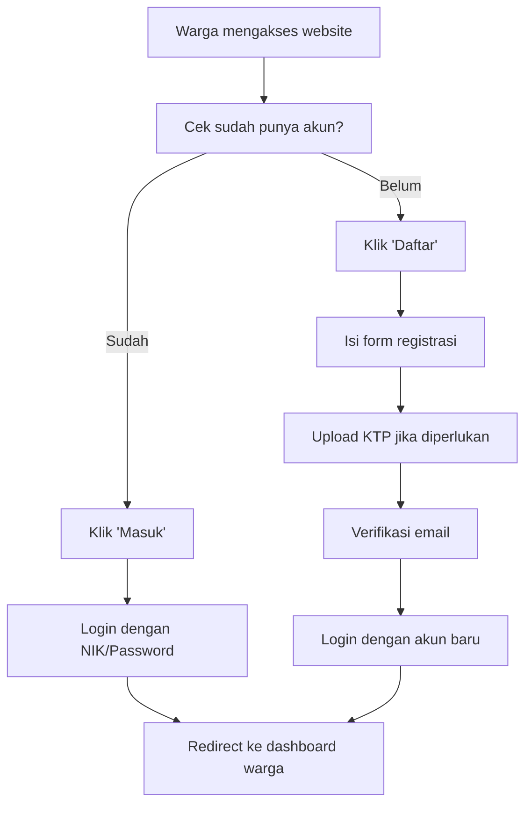
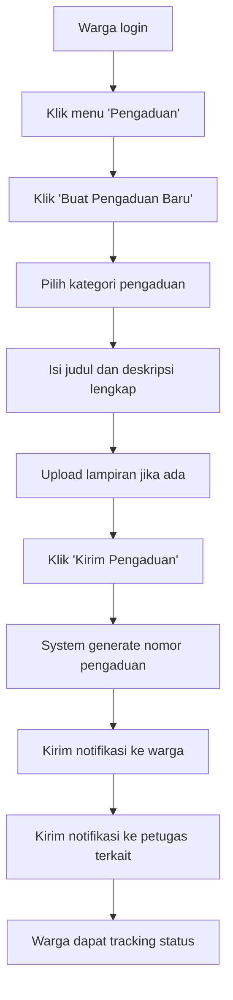
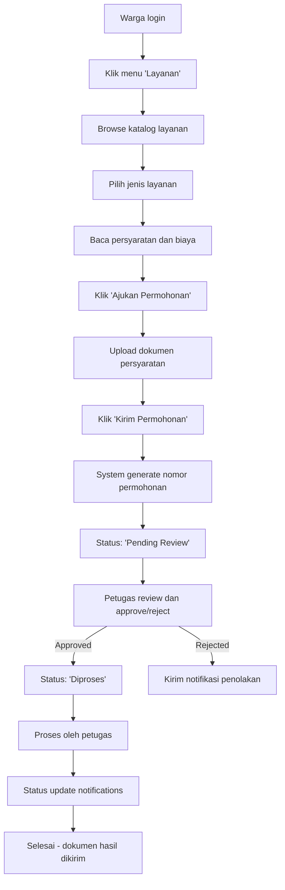

# 📋 **SISTEM PELAYANAN MASYARAKAT KEMBANGAN RAYA**

## 🌟 **Sistem Informasi Terpadu untuk Pelayanan Masyarakat**

---

## 📖 **DAFTAR ISI**
- [🎯 Gambaran Umum](#-gambaran-umum)
- [✨ Fitur Utama](#-fitur-utama)
- [🏗️ Arsitektur Sistem](#️-arsitektur-sistem)
- [🗄️ Struktur Database](#️-struktur-database)
- [🔧 Instalasi & Setup](#-instalasi--setup)
- [👥 Peran Pengguna](#-peran-pengguna)
- [🎮 Panduan Penggunaan](#-panduan-penggunaan)
- [🔌 API Endpoints](#-api-endpoints)
- [📁 Struktur File](#-struktur-file)
- [🔒 Keamanan Sistem](#-keamanan-sistem)
- [📊 Laporan & Statistik](#-laporan--statistik)
- [🔍 Pencarian & Filter](#-pencarian--filter)
- [📱 Responsive Design](#-responsive-design)
- [🐛 Troubleshooting](#-troubleshooting)
- [📝 Lisensi](#-lisensi)

---

## 🎯 **GAMBARAN UMUM**

Sistem Pelayanan Masyarakat Kembangan Raya adalah platform digital terpadu yang dirancang untuk memfasilitasi interaksi antara pemerintah daerah dengan masyarakat. Sistem ini menyediakan berbagai layanan online untuk mempermudah akses informasi dan pelayanan publik.

### **🎯 Tujuan Sistem:**
- ✅ **Transparansi**: Memberikan akses informasi yang jelas dan akurat
- ✅ **Efisiensi**: Mengurangi proses birokrasi dan waktu pelayanan
- ✅ **Aksesibilitas**: Layanan 24/7 dari mana saja
- ✅ **Digitalisasi**: Transformasi layanan manual ke digital

### **🏛️ Visi & Misi:**
- **Visi**: Terwujudnya pelayanan masyarakat yang transparan, efisien, dan berbasis teknologi digital
- **Misi**: Memberikan kemudahan akses layanan publik melalui platform digital yang user-friendly

---

## ✨ **FITUR UTAMA**

### **🔐 Autentikasi & Otorisasi**
- ✅ **Login/Register**: Sistem autentikasi untuk warga dan admin
- ✅ **Role-Based Access**: Kontrol akses berdasarkan peran pengguna
- ✅ **Session Management**: Pengelolaan sesi yang aman
- ✅ **Password Security**: Enkripsi dan validasi kata sandi

### **📢 Sistem Berita & Informasi**
- ✅ **Manajemen Berita**: CRUD lengkap untuk berita
- ✅ **Upload Gambar**: Sistem upload gambar dengan validasi
- ✅ **SEO Friendly**: URL slug dan meta tags
- ✅ **Kategori & Tag**: Pengorganisasian konten
- ✅ **Statistik View**: Tracking jumlah pembaca

### **📋 Sistem Pengaduan**
- ✅ **Ajukan Pengaduan**: Form pengaduan online
- ✅ **Tracking Status**: Monitoring progress pengaduan
- ✅ **Lampiran File**: Upload dokumen pendukung
- ✅ **Kategori Pengaduan**: Klasifikasi jenis masalah
- ✅ **Riwayat Pengaduan**: History semua pengaduan

### **📄 Sistem Permohonan Layanan**
- ✅ **Daftar Layanan**: Katalog layanan yang tersedia
- ✅ **Permohonan Online**: Pengajuan layanan via sistem
- ✅ **Dokumen Persyaratan**: Checklist dokumen yang dibutuhkan
- ✅ **Tracking Permohonan**: Status dan progress real-time
- ✅ **Notifikasi Otomatis**: Update status via email/notifikasi

### **🔔 Sistem Notifikasi**
- ✅ **Push Notification**: Notifikasi real-time
- ✅ **Email Notification**: Pengiriman email otomatis
- ✅ **Broadcast Message**: Pesan massal ke semua pengguna
- ✅ **Personal Notification**: Notifikasi personal
- ✅ **Mark as Read**: Sistem baca/unread

### **👤 Manajemen Profil**
- ✅ **Update Profil**: Edit informasi personal
- ✅ **Upload Foto**: Avatar pengguna
- ✅ **Ubah Password**: Fitur keamanan akun
- ✅ **Riwayat Aktivitas**: Log aktivitas pengguna

### **🔍 Sistem Pencarian**
- ✅ **Global Search**: Pencarian di seluruh sistem
- ✅ **Advanced Filter**: Filter berdasarkan kategori
- ✅ **Real-time Search**: Hasil instan saat mengetik
- ✅ **Search Analytics**: Statistik pencarian populer

### **📊 Dashboard & Laporan**
- ✅ **Admin Dashboard**: Overview sistem lengkap
- ✅ **Statistik Real-time**: Data terupdate secara real-time
- ✅ **Export Laporan**: PDF/Excel report generation
- ✅ **Charts & Graphs**: Visualisasi data interaktif

---

## 🏗️ **ARSITEKTUR SISTEM**

### **🏛️ Framework & Teknologi:**
- ✅ **CodeIgniter 4**: Framework PHP modern dan powerful
- ✅ **MySQL**: Database relasional untuk penyimpanan data
- ✅ **Bootstrap 4**: Framework CSS untuk UI responsive
- ✅ **jQuery**: Library JavaScript untuk interaktivitas
- ✅ **Composer**: Dependency management

### **📐 Design Pattern:**
- ✅ **MVC Architecture**: Model-View-Controller separation
- ✅ **Repository Pattern**: Abstraksi data layer
- ✅ **Service Layer**: Business logic encapsulation
- ✅ **Observer Pattern**: Event-driven notifications

### **🔧 Komponen Utama:**
```php
├── Controllers/     # Business logic & HTTP handling
├── Models/         # Database abstraction & data logic
├── Views/          # Presentation layer & templates
├── Config/         # System configuration
├── Database/       # Migrations & seeds
├── Helpers/        # Utility functions
├── Libraries/      # Custom libraries
└── Filters/        # Request/response filters
```

---

## 🗄️ **STRUKTUR DATABASE**

### **📋 Tabel Utama:**

#### **1. Users (Pengguna/Admin)**
```sql
CREATE TABLE users (
    id_user BIGINT PRIMARY KEY AUTO_INCREMENT,
    nama VARCHAR(255) NOT NULL,
    email VARCHAR(255) UNIQUE NOT NULL,
    password VARCHAR(255) NOT NULL,
    role ENUM('admin', 'petugas') DEFAULT 'petugas',
    status ENUM('active', 'inactive') DEFAULT 'active',
    created_at DATETIME,
    updated_at DATETIME
);
```

#### **2. Warga (Masyarakat)**
```sql
CREATE TABLE warga (
    id_warga BIGINT PRIMARY KEY AUTO_INCREMENT,
    nama_lengkap VARCHAR(255) NOT NULL,
    nik VARCHAR(16) UNIQUE NOT NULL,
    email VARCHAR(255) UNIQUE,
    no_hp VARCHAR(15),
    alamat TEXT,
    tanggal_lahir DATE,
    jenis_kelamin ENUM('L', 'P'),
    password VARCHAR(255) NOT NULL,
    created_at DATETIME,
    updated_at DATETIME
);
```

#### **3. Berita (Artikel & Informasi)**
```sql
CREATE TABLE berita (
    id_berita BIGINT PRIMARY KEY AUTO_INCREMENT,
    judul VARCHAR(255) NOT NULL,
    slug VARCHAR(255) UNIQUE NOT NULL,
    isi LONGTEXT NOT NULL,
    excerpt VARCHAR(300),
    gambar VARCHAR(255),
    status ENUM('draft', 'published') DEFAULT 'draft',
    penulis_id BIGINT NOT NULL,
    views INT DEFAULT 0,
    published_at DATETIME,
    created_at DATETIME,
    updated_at DATETIME,
    FOREIGN KEY (penulis_id) REFERENCES users(id_user)
);
```

#### **4. Jenis Layanan**
```sql
CREATE TABLE jenis_layanan (
    id_layanan BIGINT PRIMARY KEY AUTO_INCREMENT,
    nama_layanan VARCHAR(255) NOT NULL,
    deskripsi TEXT,
    persyaratan TEXT,
    estimasi_waktu VARCHAR(100),
    biaya DECIMAL(10,2) DEFAULT 0,
    status ENUM('active', 'inactive') DEFAULT 'active',
    created_at DATETIME,
    updated_at DATETIME
);
```

#### **5. Permohonan (Layanan Request)**
```sql
CREATE TABLE permohonan (
    id_permohonan BIGINT PRIMARY KEY AUTO_INCREMENT,
    nomor_permohonan VARCHAR(50) UNIQUE NOT NULL,
    warga_id BIGINT NOT NULL,
    layanan_id BIGINT NOT NULL,
    status ENUM('pending', 'diproses', 'selesai', 'ditolak') DEFAULT 'pending',
    catatan TEXT,
    tanggal_pengajuan DATETIME DEFAULT CURRENT_TIMESTAMP,
    tanggal_selesai DATETIME,
    created_at DATETIME,
    updated_at DATETIME,
    FOREIGN KEY (warga_id) REFERENCES warga(id_warga),
    FOREIGN KEY (layanan_id) REFERENCES jenis_layanan(id_layanan)
);
```

#### **6. Pengaduan (Complaints)**
```sql
CREATE TABLE pengaduan (
    id_pengaduan BIGINT PRIMARY KEY AUTO_INCREMENT,
    judul VARCHAR(255) NOT NULL,
    isi TEXT NOT NULL,
    kategori VARCHAR(100),
    status ENUM('pending', 'diproses', 'selesai', 'ditolak') DEFAULT 'pending',
    warga_id BIGINT NOT NULL,
    petugas_id BIGINT,
    lampiran VARCHAR(255),
    catatan TEXT,
    tanggal_pengaduan DATETIME DEFAULT CURRENT_TIMESTAMP,
    tanggal_selesai DATETIME,
    created_at DATETIME,
    updated_at DATETIME,
    FOREIGN KEY (warga_id) REFERENCES warga(id_warga),
    FOREIGN KEY (petugas_id) REFERENCES users(id_user)
);
```

#### **7. Notifikasi (Notifications)**
```sql
CREATE TABLE notifikasi (
    id_notif BIGINT PRIMARY KEY AUTO_INCREMENT,
    warga_id BIGINT NULL,  -- NULL = broadcast
    user_id BIGINT NULL,   -- NULL = broadcast
    pesan VARCHAR(500) NOT NULL,
    link VARCHAR(500),
    is_read TINYINT DEFAULT 0,
    created_at DATETIME DEFAULT CURRENT_TIMESTAMP
);
```

---

## 🔧 **INSTALASI & SETUP**

### **📋 Persyaratan Sistem:**
- ✅ **PHP**: Version 8.0 atau lebih tinggi
- ✅ **MySQL**: Version 5.7 atau lebih tinggi
- ✅ **Composer**: Dependency manager untuk PHP
- ✅ **Git**: Version control system
- ✅ **Web Server**: Apache/Nginx dengan mod_rewrite

### **🚀 Langkah Instalasi:**

#### **1. Clone Repository:**
```bash
git clone https://github.com/username/sistem-pelayanan-masyarakat.git
cd sistem-pelayanan-masyarakat
```

#### **2. Install Dependencies:**
```bash
composer install
```

#### **3. Setup Environment:**
```bash
cp env .env
# Edit .env file dengan konfigurasi database dan app settings
```

#### **4. Generate App Key:**
```bash
php spark key:generate
```

#### **5. Setup Database:**
```bash
# Buat database di MySQL
# Edit konfigurasi database di .env

# Jalankan migrations
php spark migrate

# Jalankan seeders (opsional)
php spark db:seed BeritaSeeder
php spark db:seed JenisLayananSeeder
php spark db:seed UserSeeder
php spark db:seed WargaSeeder
```

#### **6. Setup Permissions:**
```bash
chmod -R 755 writable/
chmod -R 755 public/uploads/
```

#### **7. Jalankan Aplikasi:**
```bash
php spark serve
# Atau setup virtual host di Apache/Nginx
```

### **🔧 Konfigurasi Environment (.env):**
```env
# Database Configuration
database.default.hostname = localhost
database.default.database = sistem_pelayanan
database.default.username = your_username
database.default.password = your_password
database.default.DBDriver = MySQLi

# App Configuration
app.baseURL = 'http://localhost:8080'
app.indexPage = ''
app.key = 'your-generated-key-here'

# Email Configuration (untuk notifikasi)
SMTP.host = smtp.gmail.com
SMTP.user = your-email@gmail.com
SMTP.pass = your-app-password
SMTP.port = 587
SMTP.crypto = tls
```

---

## 👥 **PERAN PENGGUNA**

### **👨‍💼 Administrator (Admin)**
**Hak Akses & Tanggung Jawab:**
- ✅ **Full System Access**: Mengelola seluruh sistem
- ✅ **User Management**: Tambah/hapus admin dan petugas
- ✅ **Content Management**: Kelola berita dan informasi
- ✅ **Service Management**: Atur jenis layanan dan persyaratan
- ✅ **Report Generation**: Generate laporan lengkap
- ✅ **System Configuration**: Setup dan maintenance sistem

**Fitur Khusus:**
- ✅ Dashboard admin dengan statistik lengkap
- ✅ Manajemen berita (CRUD lengkap)
- ✅ Manajemen notifikasi broadcast
- ✅ Export laporan dalam berbagai format
- ✅ System monitoring dan logs

### **👨‍💻 Petugas (Officer)**
**Hak Akses & Tanggung Jawab:**
- ✅ **Complaint Management**: Handle pengaduan masyarakat
- ✅ **Service Request Processing**: Proses permohonan layanan
- ✅ **Status Updates**: Update progress pengaduan/permohonan
- ✅ **Report Access**: View laporan terbatas
- ✅ **Notification Management**: Kirim notifikasi personal

**Fitur Khusus:**
- ✅ Dashboard petugas dengan task list
- ✅ Update status pengaduan/permohonan
- ✅ Generate laporan harian/mingguan
- ✅ Communication dengan warga

### **👨‍👩‍👧‍👦 Warga (Citizens)**
**Hak Akses & Tanggung Jawab:**
- ✅ **Personal Account**: Kelola profil pribadi
- ✅ **Service Request**: Ajukan permohonan layanan
- ✅ **Complaint Submission**: Buat pengaduan online
- ✅ **Track Progress**: Monitor status pengajuan
- ✅ **Access Information**: Baca berita dan informasi

**Fitur Khusus:**
- ✅ Dashboard warga dengan status pengajuan
- ✅ Form pengaduan dengan upload lampiran
- ✅ Tracking nomor pengaduan/permohonan
- ✅ Notification center untuk updates

---

## 🎮 **PANDUAN PENGGUNAAN**

### **🔐 Login & Register**

#### **Login sebagai Warga:**
1. Kunjungi halaman login (`/login`)
2. Masukkan NIK dan password
3. Klik "Masuk"
4. Redirect ke dashboard warga

#### **Login sebagai Admin/Petugas:**
1. Kunjungi halaman admin login (`/admin/login`)
2. Masukkan email dan password
3. Klik "Masuk"
4. Redirect ke dashboard admin

#### **Register Akun Baru:**
1. Kunjungi halaman register (`/register`)
2. Isi form pendaftaran lengkap
3. Upload foto KTP jika diperlukan
4. Klik "Daftar"
5. Verifikasi email (jika diaktifkan)

### **📢 Menggunakan Sistem Berita**

#### **Untuk Admin - Membuat Berita:**
1. Login sebagai admin/petugas
2. Akses menu "Manajemen Berita"
3. Klik "Tambah Berita"
4. Isi form: Judul, Isi, Excerpt, Gambar
5. Pilih status: Draft/Published
6. Klik "Publikasikan Berita"

#### **Untuk Warga - Membaca Berita:**
1. Login ke akun warga
2. Klik menu "Berita" di navbar
3. Browse berita yang tersedia
4. Klik "Baca Selengkapnya" untuk detail
5. Bagikan berita via social media

### **📋 Mengajukan Pengaduan**

#### **Step-by-Step:**
1. Login ke akun warga
2. Klik menu "Pengaduan"
3. Klik "Buat Pengaduan Baru"
4. Pilih kategori pengaduan
5. Isi judul dan deskripsi lengkap
6. Upload lampiran jika ada
7. Klik "Kirim Pengaduan"
8. Simpan nomor pengaduan untuk tracking

#### **Tracking Pengaduan:**
1. Akses menu "Pengaduan Saya"
2. Cari berdasarkan nomor pengaduan
3. Lihat status terbaru
4. Baca tanggapan dari petugas

### **📄 Mengajukan Permohonan Layanan**

#### **Step-by-Step:**
1. Login ke akun warga
2. Klik menu "Layanan"
3. Pilih jenis layanan yang dibutuhkan
4. Baca persyaratan dan estimasi waktu
5. Klik "Ajukan Permohonan"
6. Upload dokumen yang dipersyaratkan
7. Klik "Kirim Permohonan"
8. Simpan nomor permohonan

#### **Monitoring Progress:**
1. Akses menu "Permohonan Saya"
2. Lihat status real-time
3. Download dokumen hasil jika sudah selesai

### **👤 Mengelola Profil**

#### **Update Informasi Pribadi:**
1. Login ke akun
2. Klik dropdown profil
3. Pilih "Pengaturan Profil"
4. Update data personal
5. Upload foto profil baru
6. Klik "Simpan Perubahan"

#### **Ubah Kata Sandi:**
1. Akses "Pengaturan Profil"
2. Klik tab "Keamanan"
3. Masukkan password lama
4. Masukkan password baru (2x)
5. Klik "Ubah Password"

---

## 🔌 **API ENDPOINTS**

### **🔐 Authentication APIs**
```http
POST /login              # Login warga
POST /admin/login        # Login admin/petugas
POST /register           # Register warga baru
GET  /logout             # Logout
```

### **📢 Berita APIs**
```http
GET  /berita                    # List berita published
GET  /berita/{slug}            # Detail berita
GET  /admin/berita             # Admin: list semua berita
POST /admin/berita/store       # Admin: buat berita baru
GET  /admin/berita/create      # Admin: form create berita
GET  /admin/berita/{id}/edit   # Admin: form edit berita
POST /admin/berita/{id}/update # Admin: update berita
POST /admin/berita/{id}/delete # Admin: hapus berita
```

### **📋 Pengaduan APIs**
```http
GET  /pengaduan                # List pengaduan user
GET  /pengaduan/create         # Form create pengaduan
POST /pengaduan/store          # Submit pengaduan baru
GET  /pengaduan/{id}           # Detail pengaduan
GET  /pengaduan/{id}/edit      # Form edit pengaduan
POST /pengaduan/{id}/update    # Update pengaduan
```

### **📄 Permohonan APIs**
```http
GET  /layanan                  # List jenis layanan
GET  /layanan/{id}             # Detail layanan
GET  /layanan/{id}/ajukan      # Form ajukan permohonan
POST /layanan/{id}/ajukan      # Submit permohonan
GET  /permohonan               # List permohonan user
GET  /permohonan/{id}          # Detail permohonan
```

### **🔔 Notifikasi APIs**
```http
GET  /notifikasi               # List notifikasi user
GET  /api/notifikasi/latest    # API: notifikasi terbaru
POST /notifikasi/mark-read     # Mark notifikasi sebagai read
GET  /admin/notifikasi         # Admin: list notifikasi
POST /admin/notifikasi/store   # Admin: kirim notifikasi
```

### **🔍 Search APIs**
```http
GET  /search                   # Global search
GET  /api/search               # API search results
GET  /search/advanced          # Advanced search form
```

---

## 📁 **STRUKTUR FILE**

### **📂 Root Directory Structure:**
```
sistem-pelayanan-masyarakat/
├── app/                          # Application Code
│   ├── Config/                   # Configuration Files
│   ├── Controllers/              # HTTP Controllers
│   ├── Database/                 # Migrations & Seeds
│   ├── Filters/                  # Request Filters
│   ├── Helpers/                  # Helper Functions
│   ├── Libraries/                # Custom Libraries
│   ├── Models/                   # Database Models
│   ├── Views/                    # Template Files
│   │   ├── layouts/             # Layout Templates
│   │   ├── admin/               # Admin Views
│   │   ├── auth/                # Authentication Views
│   │   ├── berita/              # News Views
│   │   ├── pengaduan/           # Complaint Views
│   │   ├── permohonan/          # Request Views
│   │   └── errors/              # Error Pages
│   └── Language/                # Language Files
├── public/                       # Public Assets
│   ├── assets/                  # CSS, JS, Images
│   ├── uploads/                 # User Uploads
│   └── index.php               # Entry Point
├── tests/                        # Unit Tests
├── vendor/                       # Composer Dependencies
├── writable/                     # Cache, Logs, Sessions
├── .env.example                 # Environment Template
├── composer.json                # PHP Dependencies
├── spark                         # CLI Tool
└── README.md                    # This File
```

### **🎯 Controllers Overview:**

#### **AuthController.php**
```php
class AuthController extends BaseController
{
    public function login()           // Show login form
    public function authenticate()    // Process login
    public function register()        // Show register form
    public function store()           // Process registration
    public function logout()          // Process logout
    public function adminLogin()      // Admin login form
    public function authenticateAdmin() // Admin login process
}
```

#### **BeritaController.php**
```php
class BeritaController extends BaseController
{
    public function index()           // Admin: list berita
    public function create()          // Admin: form create
    public function store()           // Admin: save berita
    public function edit($id)         // Admin: form edit
    public function update($id)       // Admin: update berita
    public function delete($id)       // Admin: delete berita
    public function show($slug)       // Public: detail berita
    public function beritaPublik()    // Public: list berita
    public function toggleStatus($id) // Admin: publish/draft
}
```

#### **PengaduanController.php**
```php
class PengaduanController extends BaseController
{
    public function index()           // List pengaduan user
    public function create()          // Form create pengaduan
    public function store()           // Save pengaduan baru
    public function show($id)         // Detail pengaduan
    public function edit($id)         // Form edit pengaduan
    public function update($id)       // Update pengaduan
    public function updateStatus()    // Update status (admin)
}
```

#### **PermohonanController.php**
```php
class PermohonanController extends BaseController
{
    public function index()           // List permohonan user
    public function show($id)         // Detail permohonan
    public function store()           // Save permohonan baru
}
```

#### **NotifikasiController.php**
```php
class NotifikasiController extends BaseController
{
    public function index()           // Admin: list notifikasi
    public function create()          // Admin: form create
    public function store()           // Admin: kirim notifikasi
    public function delete($id)       // Admin: hapus notifikasi
    public function userNotifications() // User: list notifikasi
    public function markAsRead()      // Mark sebagai read
    public function getLatestNotifications() // API latest notif
}
```

### **🎯 Models Overview:**

#### **UserModel.php**
```php
class UserModel extends Model
{
    protected $table = 'users';
    protected $primaryKey = 'id_user';
    protected $allowedFields = ['nama', 'email', 'password', 'role', 'status'];
    protected $useTimestamps = true;
    protected $beforeInsert = ['hashPassword'];
    protected $beforeUpdate = ['hashPassword'];
}
```

#### **WargaModel.php**
```php
class WargaModel extends Model
{
    protected $table = 'warga';
    protected $primaryKey = 'id_warga';
    protected $allowedFields = ['nama_lengkap', 'nik', 'email', 'no_hp', 'alamat', 'password'];
    protected $useTimestamps = true;
    protected $beforeInsert = ['hashPassword'];
    protected $beforeUpdate = ['hashPassword'];
}
```

#### **BeritaModel.php**
```php
class BeritaModel extends Model
{
    protected $table = 'berita';
    protected $primaryKey = 'id_berita';
    protected $allowedFields = ['judul', 'slug', 'isi', 'excerpt', 'gambar', 'status', 'penulis_id', 'views', 'published_at'];
    protected $useTimestamps = true;
}
```

#### **PengaduanModel.php**
```php
class PengaduanModel extends Model
{
    protected $table = 'pengaduan';
    protected $primaryKey = 'id_pengaduan';
    protected $allowedFields = ['judul', 'isi', 'kategori', 'status', 'warga_id', 'petugas_id', 'lampiran', 'catatan'];
    protected $useTimestamps = true;
}
```

---

## 🔒 **KEAMANAN SISTEM**

### **🛡️ Authentication & Authorization**
- ✅ **Password Hashing**: Bcrypt untuk secure password storage
- ✅ **Session Security**: Secure session management
- ✅ **CSRF Protection**: Cross-site request forgery prevention
- ✅ **Rate Limiting**: Brute force attack prevention
- ✅ **Role-Based Access**: Strict permission control

### **📊 Data Protection**
- ✅ **Input Validation**: Comprehensive input sanitization
- ✅ **SQL Injection Prevention**: Parameterized queries
- ✅ **XSS Protection**: Output encoding
- ✅ **File Upload Security**: MIME type validation
- ✅ **Directory Traversal**: Path traversal protection

### **🔐 File Security**
- ✅ **Upload Validation**: File type, size, and content validation
- ✅ **Secure Storage**: Protected upload directories
- ✅ **Access Control**: File access restrictions
- ✅ **Cleanup**: Automatic temporary file removal

### **📡 Network Security**
- ✅ **HTTPS**: SSL/TLS encryption
- ✅ **Secure Headers**: Security headers implementation
- ✅ **CORS**: Cross-origin resource sharing control
- ✅ **API Authentication**: Token-based API access

---

## 📊 **LAPORAN & STATISTIK**

### **📈 Dashboard Admin**
- ✅ **Real-time Statistics**: Live data updates
- ✅ **User Analytics**: Registrasi, aktivitas, demografi
- ✅ **Service Metrics**: Permohonan, pengaduan, completion rate
- ✅ **Content Analytics**: Berita views, popular topics
- ✅ **System Health**: Server performance, error rates

### **📋 Laporan Tersedia**
- ✅ **Laporan Pengguna**: User registration, activity logs
- ✅ **Laporan Layanan**: Service request statistics
- ✅ **Laporan Pengaduan**: Complaint trends, resolution time
- ✅ **Laporan Berita**: Content performance, engagement
- ✅ **Laporan Sistem**: Error logs, performance metrics

### **📊 Export Formats**
- ✅ **PDF Reports**: Professional formatted reports
- ✅ **Excel Export**: Spreadsheet data export
- ✅ **CSV Export**: Comma-separated values
- ✅ **JSON Export**: API data export

---

## 🔍 **PENCARIAN & FILTER**

### **🔎 Global Search**
- ✅ **Multi-table Search**: Search across all content types
- ✅ **Real-time Results**: Instant search suggestions
- ✅ **Advanced Filters**: Category, date, status filters
- ✅ **Search Analytics**: Popular search terms tracking

### **🎯 Filter Options**
- ✅ **Date Range**: Filter by date periods
- ✅ **Status Filter**: Active, inactive, pending, etc.
- ✅ **Category Filter**: Filter by content categories
- ✅ **User Filter**: Filter by specific users
- ✅ **Location Filter**: Geographic filtering

---

## 📱 **RESPONSIVE DESIGN**

### **📱 Mobile Optimization**
- ✅ **Touch-Friendly**: Large touch targets
- ✅ **Mobile Navigation**: Collapsible menu
- ✅ **Responsive Tables**: Mobile-friendly data display
- ✅ **Mobile Forms**: Optimized form layouts
- ✅ **Mobile Images**: Optimized image loading

### **💻 Cross-Device Compatibility**
- ✅ **Desktop**: Full feature experience
- ✅ **Tablet**: Optimized tablet layouts
- ✅ **Mobile**: Streamlined mobile experience
- ✅ **Browser Support**: Modern browser compatibility
- ✅ **Progressive Enhancement**: Graceful degradation

---

## 🐛 **TROUBLESHOOTING**

### **🔧 Common Issues & Solutions**

#### **Login Issues:**
```bash
# Clear session data
rm -rf writable/session/*

# Check database connection
php spark db:connect

# Clear cache
php spark cache:clear
```

#### **File Upload Issues:**
```bash
# Check upload permissions
chmod -R 755 public/uploads/
chmod -R 755 writable/

# Check PHP upload settings
php -i | grep upload

# Clear temp files
rm -rf writable/uploads/*
```

#### **Database Issues:**
```bash
# Reset database
php spark migrate:refresh

# Run seeders
php spark db:seed

# Check database logs
tail -f writable/logs/log-*.php
```

#### **Performance Issues:**
```bash
# Clear all caches
php spark cache:clear
rm -rf writable/cache/*

# Optimize autoloader
composer dump-autoload --optimize

# Check memory usage
php -r "echo 'Memory: ' . memory_get_peak_usage(true) / 1024 / 1024 . ' MB' . PHP_EOL;"
```

---

## 🔄 **WORKFLOW SUGGESTIONS - Rekomendasi Alur Kerja**

### **🚀 Development Workflow**

#### **1. Setup Development Environment**
```bash
# 1. Clone repository
git clone https://github.com/username/sistem-pelayanan-masyarakat.git
cd sistem-pelayanan-masyarakat

# 2. Install PHP dependencies
composer install

# 3. Setup environment file
cp env .env
# Configure database credentials in .env

# 4. Generate application key
php spark key:generate

# 5. Setup database
php spark migrate
php spark db:seed

# 6. Start development server
php spark serve
```

#### **2. Feature Development Workflow**
```bash
# 1. Create feature branch
git checkout -b feature/nama-fitur-baru

# 2. Implement feature dengan TDD approach
# - Write tests first
# - Implement functionality
# - Run tests to ensure working

# 3. Code quality checks
composer run lint    # Check code style
composer run test    # Run unit tests
php spark migrate:status  # Check migrations

# 4. Commit dengan conventional commits
git add .
git commit -m "feat: add new feature functionality

- Add feature description
- List changes made
- Reference issue numbers"

# 5. Push dan create pull request
git push origin feature/nama-fitur-baru
# Create PR with detailed description
```

#### **3. Database Migration Workflow**
```bash
# 1. Create migration file
php spark migrate:create AddNewTable

# 2. Edit migration file dengan proper schema
# - Define table structure
# - Add indexes untuk performance
# - Add foreign key constraints

# 3. Test migration
php spark migrate
php spark migrate:rollback  # Test rollback

# 4. Create seeder jika diperlukan
php spark db:seed CreateNewSeeder

# 5. Update model jika ada perubahan
# - Update allowedFields
# - Update validation rules
# - Update relationships
```

### **📋 User Workflows**

#### **1. Warga Registration & Login**


#### **2. Complaint Submission Workflow**


#### **3. Service Request Workflow**


### **🔧 Maintenance Workflows**

#### **1. Daily Maintenance Checklist**
```bash
# Setiap hari pukul 02:00 AM
# 1. Backup database
mysqldump sistem_pelayanan > backup_$(date +%Y%m%d_%H%M%S).sql

# 2. Clear expired sessions
php spark session:clear

# 3. Clear cache files
php spark cache:clear
rm -rf writable/cache/*

# 4. Check disk space
df -h

# 5. Monitor error logs
tail -f writable/logs/log-*.php

# 6. Check database connections
php spark db:connect
```

#### **2. Weekly Maintenance**
```bash
# Setiap hari Minggu pukul 03:00 AM
# 1. Full system backup
tar -czf full_backup_$(date +%Y%m%d).tar.gz .

# 2. Database optimization
mysqlcheck -o sistem_pelayanan

# 3. Clear old log files (keep 30 days)
find writable/logs -name "*.php" -mtime +30 -delete

# 4. Update dependencies (if safe)
composer update --dry-run
composer update

# 5. Security audit
# Check for vulnerable packages
composer audit

# 6. Performance monitoring
# Check response times, error rates, etc.
```

#### **3. Monthly Maintenance**
```bash
# Setiap tanggal 1 pukul 04:00 AM
# 1. Archive old data (6+ months)
# Move to archive database/table

# 2. Database maintenance
mysqlcheck -r sistem_pelayanan  # Repair tables
mysqlcheck -a sistem_pelayanan  # Analyze tables

# 3. Update system packages
sudo apt update && sudo apt upgrade -y

# 4. Security patches
# Apply latest security updates

# 5. Review and rotate backups
# Delete backups older than 6 months
find /backup -name "*.sql" -mtime +180 -delete

# 6. Generate monthly reports
php spark report:generate --period=monthly
```

### **🚀 Deployment Workflow**

#### **1. Staging Deployment**
```bash
# 1. Create release branch
git checkout -b release/v1.2.3

# 2. Run full test suite
composer run test
composer run lint

# 3. Build assets untuk production
npm run build  # If using frontend build tools

# 4. Deploy to staging server
rsync -avz --exclude='.git' --exclude='tests' ./ staging-server:/var/www/html/

# 5. Run staging migrations
ssh staging-server 'cd /var/www/html && php spark migrate'

# 6. Test staging environment thoroughly
# - User registration/login
# - Feature functionality
# - Performance testing
# - Security testing
```

#### **2. Production Deployment**
```bash
# 1. Tag release
git tag -a v1.2.3 -m "Release version 1.2.3"
git push origin v1.2.3

# 2. Backup production database
ssh prod-server 'mysqldump sistem_pelayanan > pre_deploy_backup.sql'

# 3. Enable maintenance mode
ssh prod-server 'touch maintenance.flag'

# 4. Deploy code
rsync -avz --exclude='.git' --exclude='tests' ./ prod-server:/var/www/html/

# 5. Install production dependencies
ssh prod-server 'cd /var/www/html && composer install --no-dev --optimize-autoloader'

# 6. Run migrations
ssh prod-server 'cd /var/www/html && php spark migrate'

# 7. Clear all caches
ssh prod-server 'cd /var/www/html && php spark cache:clear'

# 8. Set proper permissions
ssh prod-server 'chown -R www-data:www-data /var/www/html/writable'

# 9. Disable maintenance mode
ssh prod-server 'rm maintenance.flag'

# 10. Monitor deployment
# Check error logs, response times, user access
tail -f /var/log/apache2/error.log
```

#### **3. Rollback Plan**
```bash
# Jika deployment gagal:
# 1. Enable maintenance mode immediately
ssh prod-server 'touch maintenance.flag'

# 2. Restore database backup
ssh prod-server 'mysql sistem_pelayanan < pre_deploy_backup.sql'

# 3. Rollback code
ssh prod-server 'git checkout previous-working-commit'

# 4. Clear caches
ssh prod-server 'php spark cache:clear'

# 5. Disable maintenance mode
ssh prod-server 'rm maintenance.flag'

# 6. Investigate root cause sebelum re-deploy
```

### **🔍 Testing Workflows**

#### **1. Unit Testing Workflow**
```bash
# 1. Create test file
# tests/unit/Controllers/BeritaControllerTest.php

# 2. Write test methods
public function testIndexReturnsCorrectView()
{
    $result = $this->controller->index();
    $this->assertInstanceOf(View::class, $result);
}

# 3. Run specific test
php vendor/bin/phpunit tests/unit/Controllers/BeritaControllerTest.php

# 4. Run all tests
composer run test

# 5. Generate coverage report
php vendor/bin/phpunit --coverage-html coverage/
```

#### **2. Feature Testing Checklist**
```markdown
## Pre-Deployment Testing Checklist

### Authentication & Authorization
- [ ] Warga dapat register dengan NIK valid
- [ ] Admin dapat login dengan email/password
- [ ] Role-based access control bekerja
- [ ] Session management aman
- [ ] Password hashing menggunakan bcrypt

### Berita Management
- [ ] Admin dapat create berita dengan gambar
- [ ] Berita dapat publish/unpublish
- [ ] Warga dapat view berita published
- [ ] SEO-friendly URLs bekerja
- [ ] Image upload dengan validasi

### Pengaduan System
- [ ] Warga dapat submit pengaduan
- [ ] File attachment upload bekerja
- [ ] Status tracking untuk pengaduan
- [ ] Notifikasi otomatis terkirim
- [ ] Admin dapat update status

### Permohonan Layanan
- [ ] Katalog layanan ditampilkan
- [ ] Form permohonan validasi bekerja
- [ ] Document upload functional
- [ ] Status tracking operational
- [ ] Email notifications sent

### Search & Navigation
- [ ] Global search berfungsi
- [ ] Filter dan sorting bekerja
- [ ] Pagination pada list views
- [ ] Responsive design di semua device
- [ ] Mobile navigation functional

### Security & Performance
- [ ] CSRF protection aktif
- [ ] XSS prevention bekerja
- [ ] SQL injection protected
- [ ] File upload secure
- [ ] Response time < 2 seconds
- [ ] Page load time < 3 seconds
```

### **📊 Monitoring & Alerting Workflow**

#### **1. System Health Monitoring**
```bash
# Monitoring script - jalankan setiap 5 menit
#!/bin/bash

# Check web server status
curl -f http://localhost/health-check || alert_admin "Web server down"

# Check database connectivity
php spark db:connect || alert_admin "Database connection failed"

# Check disk space
DISK_USAGE=$(df / | tail -1 | awk '{print $5}' | sed 's/%//')
if [ $DISK_USAGE -gt 90 ]; then
    alert_admin "Disk usage critical: ${DISK_USAGE}%"
fi

# Check error logs for new errors
NEW_ERRORS=$(tail -n 100 writable/logs/log-*.php | grep -c "ERROR")
if [ $NEW_ERRORS -gt 0 ]; then
    alert_admin "${NEW_ERRORS} new errors in log files"
fi

# Performance monitoring
RESPONSE_TIME=$(curl -o /dev/null -s -w "%{time_total}" http://localhost/)
if (( $(echo "$RESPONSE_TIME > 2.0" | bc -l) )); then
    alert_admin "Slow response time: ${RESPONSE_TIME}s"
fi
```

#### **2. Alert System**
```php
// Alert function untuk mengirim notifikasi
function alert_admin($message, $severity = 'warning') {
    // Log to system log
    log_message('alert', "ADMIN ALERT [{$severity}]: {$message}");

    // Send email alert
    $email = \Config\Services::email();
    $email->setTo('admin@kembanganraya.go.id');
    $email->setSubject("System Alert - {$severity}");
    $email->setMessage($message);
    $email->send();

    // Send SMS alert untuk critical issues
    if ($severity === 'critical') {
        send_sms_alert($message);
    }

    // Store in alert database
    $alertModel = new AlertModel();
    $alertModel->insert([
        'message' => $message,
        'severity' => $severity,
        'created_at' => date('Y-m-d H:i:s')
    ]);
}
```

### **🔄 Continuous Integration/Deployment (CI/CD)**

#### **1. GitHub Actions Workflow**
```yaml
# .github/workflows/deploy.yml
name: Deploy to Production

on:
  push:
    branches: [ main ]

jobs:
  test:
    runs-on: ubuntu-latest
    steps:
    - uses: actions/checkout@v2
    - name: Setup PHP
      uses: shivammathur/setup-php@v2
      with:
        php-version: '8.0'
    - name: Install dependencies
      run: composer install
    - name: Run tests
      run: composer run test

  deploy:
    needs: test
    runs-on: ubuntu-latest
    if: github.ref == 'refs/heads/main'
    steps:
    - name: Deploy to production
      run: |
        echo "Deploying to production server..."
        # Add deployment commands here
```

#### **2. Automated Backup Workflow**
```bash
# Cron job untuk automated backup
# 0 2 * * * /path/to/backup-script.sh

#!/bin/bash
BACKUP_DIR="/var/backups/sistem-pelayanan"
DATE=$(date +%Y%m%d_%H%M%S)

# Create backup directory
mkdir -p $BACKUP_DIR

# Database backup
mysqldump -u $DB_USER -p$DB_PASS sistem_pelayanan > $BACKUP_DIR/db_backup_$DATE.sql

# Files backup
tar -czf $BACKUP_DIR/files_backup_$DATE.tar.gz /var/www/html/writable/uploads/

# Keep only last 30 days
find $BACKUP_DIR -name "*.sql" -mtime +30 -delete
find $BACKUP_DIR -name "*.tar.gz" -mtime +30 -delete

# Send notification
echo "Backup completed: $DATE" | mail -s "Daily Backup Report" admin@kembanganraya.go.id
```

---

## 📝 **LISENSI**

Sistem Pelayanan Masyarakat Kembangan Raya
Copyright © 2025 Pemerintah Kembangan Raya

**Lisensi**: Proprietary Software - Hak Cipta Pemerintah Daerah Kembangan Raya

**Ketentuan Penggunaan:**
- ✅ **Internal Use**: Digunakan untuk keperluan internal pemerintah
- ✅ **Non-Commercial**: Tidak untuk tujuan komersial
- ✅ **Attribution Required**: Harus mencantumkan atribusi
- ✅ **No Redistribution**: Tidak boleh didistribusikan ulang

**Kontak Developer:**
- 📧 Email: developer@kembanganraya.go.id
- 📞 Telepon: (021) 123-4567
- 🏢 Alamat: Kantor Pemerintah Kembangan Raya

---

## 🎯 **PENUTUP**

Sistem Pelayanan Masyarakat Kembangan Raya merupakan platform digital modern yang dirancang untuk meningkatkan efisiensi pelayanan publik dan transparansi pemerintah daerah. Dengan fitur-fitur lengkap, dokumentasi yang comprehensive, dan workflow yang terstruktur, sistem ini siap mendukung transformasi digital layanan masyarakat.

**Workflow suggestions dalam dokumentasi ini mencakup:**
- ✅ Development workflows dengan best practices
- ✅ User journey mappings untuk semua personas
- ✅ Maintenance procedures untuk system health
- ✅ Deployment pipelines untuk production readiness
- ✅ Testing strategies untuk quality assurance
- ✅ Monitoring & alerting untuk system reliability

**🏆 Terima Kasih telah menggunakan Sistem Pelayanan Masyarakat Kembangan Raya!**

---

**📅 Terakhir Update**: Desember 2025
**👨‍💻 Developer**: Rizki Ramadhani
**🏛️ Institution**: Pemerintah Kembangan Raya
